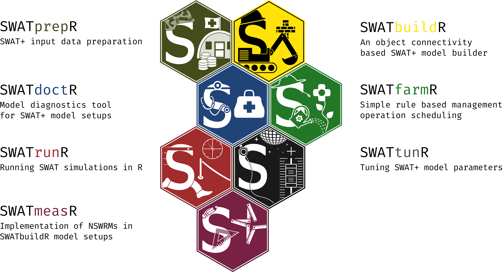

---
title: "Introduction to SWATprepR"
<!-- output: rmarkdown::html_vignette -->
output: github_document
bibliography: vignettes/ref.bib
vignette: >
  %\VignetteIndexEntry{Introduction to SWATprepR}
  %\VignetteEngine{knitr::rmarkdown}
  %\VignetteEncoding{UTF-8}
development:
  mode: auto
---

```{r setup, include = FALSE}
knitr::opts_chunk$set(
  collapse = TRUE,
  comment = "#>",
  fig.path = "man/figures/"
)
library(badger)
```

# SWATprepR

`r badge_devel("biopsichas/SWATprepR", "gold")`
`r badge_last_commit("biopsichas/SWATprepR", "green")`
`r badge_lifecycle(stage = "stable")`
`r badge_repostatus("active")`
`r badge_code_size("biopsichas/SWATprepR")`
`r badge_license("MIT")`
`r badge_doi("https://doi.org/10.1186/s12302-024-00873-1", "yellow")`

The goal of `SWATprepR` is to help with the [SWAT+ model](https://swat.tamu.edu/software/plus/) input data preparation. A detailed overview is presented in the article by @plunge2024b. Most functions were developed for the implementation of modeling tasks in the [OPTAIN project](https://www.optain.eu/). These tools are intended to fill the gaps in the SWAT+ workflow alongside the main tools developed by [Christoph Schuerz](https://www.ufz.de/index.php?en=49467). Therefore, we highly recommend trying and using these tools:

- [SWATbuildR](https://git.ufz.de/optain/wp4-integrated-assessment/swat/bildr_script)^[For access please inquire at *christoph.schuerz@ufz.de*.] - R tool for building SWAT+ setups.
- [SWATfarmR](http://chrisschuerz.github.io/SWATfarmR/) - R tool for preparing management schedules for the SWAT model.
- [SWATdoctR](https://git.ufz.de/schuerz/swatdoctr) - A collection of functions in R and routines for SWAT model diagnostics. The package is presented in the article by @plunge2024a.
- [SWATrunR](https://chrisschuerz.github.io/SWATrunR/) - R tool for running SWAT models for different parameters and scenarios.
- [SWATtunR](https://biopsichas.github.io/SWATtunR/) - R tool for soft & hard calibration, validation of SWAT+ models.
- [SWATmeasR](https://git.ufz.de/schuerz/swatmeasr) - R tool for implementing Natural/Small Water Retention Measures (NSWRMs) in the SWAT+ models and running scenarios.



Detailed information about packages, workflow steps, input data, SWAT+ parameters, model calibration, validation, etc., can be found in the [SWAT+ modeling protocol](https://doi.org/10.5281/zenodo.7463395) by @optain2022.

## Installation

You can install the development version of `SWATprepR` from [GitHub](https://github.com/biopsichas/SWATprepR). Please be aware that to run the `get_usersoil_table()` function, the `euptf2` [package](https://github.com/tkdweber/euptf2) has to be installed. More information about this package can be found in the article by @szabo2020.

``` r
# If the package 'remotes' is not installed run first:
install.packages("remotes")

# The installation of `SWATprepR`.
remotes::install_github("biopsichas/SWATprepR")
# The `euptf2` package has to be installed to utilize `get_usersoil_table()` function.
remotes::install_github("tkdweber/euptf2")
```

## Data

All the data required to run and test the package is installed with the package in the extdata folder. The exact location on your computer can be found by running the lines below. Please run these commands on your system to locate it.  

```{r data}
library(SWATprepR)
temp_path <- system.file("extdata", package = "SWATprepR")
print(temp_path)
```

## Templates

To use the `SWATprepR` package functions with your data, you should prepare your data to align with the templates provided in the *extdata* folder. These templates include:

- **calibration_data.xlsx** - template for loading calibration (water flow and water quality variables) data.
- **weather_data.xlsx** - template for loading weather variables.
- **usersoils.csv** - example of a soil parameters dataset.
- **pnt_data.xlsx** - template for a point source dataset.
- **GIS/** - folder with GIS layers needed to run some functions.

Data prepared according to these templates can be directly loaded into R, allowing you to apply all the functions as described.


<br>

## References
