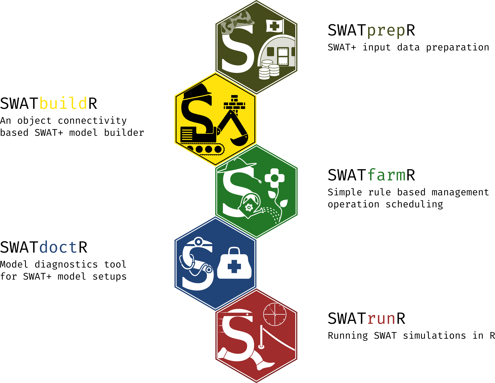

---
title: "Introduction to SWATprepR"
<!-- output: rmarkdown::html_vignette -->
output: github_document
vignette: >
  %\VignetteIndexEntry{Introduction to SWATprepR}
  %\VignetteEngine{knitr::rmarkdown}
  %\VignetteEncoding{UTF-8}
development:
  mode: auto
---

```{r setup, include = FALSE}
knitr::opts_chunk$set(
  collapse = TRUE,
  comment = "#>",
  fig.path = "man/figures/"
)
library(badger)
```

# SWATprepR

`r badge_devel("biopsichas/SWATprepR", "gold")`
`r badge_last_commit("biopsichas/SWATprepR", "green")`
`r badge_lifecycle(stage = "stable")`
`r badge_repostatus("active")`
`r badge_code_size("biopsichas/SWATprepR")`
`r badge_license("MIT")`
`r badge_doi("https://doi.org/10.5281/zenodo.7296033", "yellow")`

The goal of `SWATprepR` is to help with the [SWAT+ model](https://swat.tamu.edu/software/plus/) input data preparation. There are mostly functions, which were developed for the implementation of modeling tasks in the [OPTAIN project](https://www.optain.eu/). These tools are intended to fill the gaps in the SWAT+ workflow along side the main tools developed by [Christoph Schuerz](https://www.ufz.de/index.php?en=49467). Therefore, we highly recommend trying and using these tools:

- [SWATbuildR](https://git.ufz.de/optain/wp4-integrated-assessment/swat/bildr_script)^[Currently requires access to OPTAIN https://git.ufz.de/optain] - R tool for building SWAT+ setups;
- [SWATfarmR](http://chrisschuerz.github.io/SWATfarmR/) - R tool for preparing management schedules for SWAT model;
- [SWATdoctR](https://git.ufz.de/schuerz/swatdoctr)^[Currently requires access to OPTAIN https://git.ufz.de/optain] - A collection of functions in R and routines for SWAT model calibration and model diagnostics;
- [SWATrunR (former SWATplusR)](https://chrisschuerz.github.io/SWATplusR/articles/SWATplusR.html) - R tool for sensitivity analyse, model calibration and validation.




Detailed information about packages, workflow steps, input data, SWAT+ parameters, model calibration, validation, etc., could be found in the [SWAT+ modeling protocol](https://doi.org/10.5281/zenodo.7463395).

## Installation

You can install the development version of SWATprepR from [GitHub](https://github.com/) with:

``` r
# install.packages("devtools")
devtools::install_github("biopsichas/SWATprepR")
# euptf2 package is needed and used for soil parameter functions
devtools::install_github("tkdweber/euptf2")
```

## Data

All the data required to run and test package are installed with package in the extdata folder. Exact location on computer could be found running lines below. Please run it on your system to find it for you.   

```{r data, eval = FALSE}
library(SWATprepR)
temp_path <- system.file("extdata", package = "SWATprepR")
print(temp_path)
```

## Templates

In order to use *SWATprepR* package functions with your data you should prepare your data to be inline with templates we have provided in *extdata* folder. Such are:

- **calibration_data.xlsx** - template for loading calibration (water flow and water quality variables) data.
- **weather_data.xlsx** - template for loading weather variables.
- **usersoils.csv** - example of loading soil parameters dataset. 
- **GIS/** - folder with GIS layers needed to run some functions.

Data prepared according to templates can be directly loaded into R and all the functions applied as described. 
