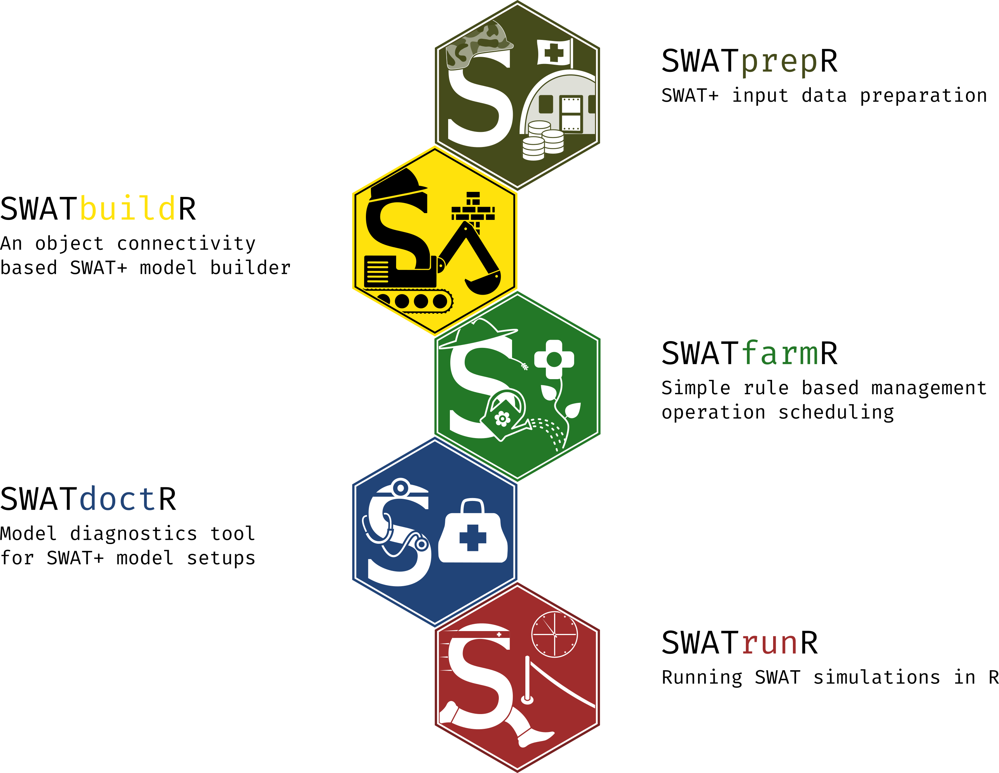

Introduction to SWATprepR
================

# SWATprepR

[](https://github.com/biopsichas/SWATprepR)
[](https://github.com/biopsichas/SWATprepR/commits/green)
[](https://lifecycle.r-lib.org/articles/stages.html#stable)
[](https://www.repostatus.org/#active)
[](https://github.com/biopsichas/SWATprepR)
[](https://cran.r-project.org/web/licenses/MIT)
[](https://doi.org/https://doi.org/10.5281/zenodo.10167075)

The goal of `SWATprepR` is to help with the [SWAT+
model](https://swat.tamu.edu/software/plus/) input data preparation.
There are mostly functions, which were developed for the implementation
of modeling tasks in the [OPTAIN project](https://www.optain.eu/). These
tools are intended to fill the gaps in the SWAT+ workflow along side the
main tools developed by [Christoph
Schuerz](https://www.ufz.de/index.php?en=49467). Therefore, we highly
recommend trying and using these tools:

- [SWATbuildR](https://git.ufz.de/optain/wp4-integrated-assessment/swat/bildr_script)[^1] -
  R tool for building SWAT+ setups;
- [SWATfarmR](http://chrisschuerz.github.io/SWATfarmR/) - R tool for
  preparing management schedules for SWAT model;
- [SWATdoctR](https://git.ufz.de/schuerz/swatdoctr) - A collection of
  functions in R and routines for SWAT model calibration and model
  diagnostics;
- [SWATrunR (former
  SWATplusR)](https://chrisschuerz.github.io/SWATplusR/articles/SWATplusR.html) -
  R tool for sensitivity analyse, model calibration and validation.



Detailed information about packages, workflow steps, input data, SWAT+
parameters, model calibration, validation, etc., could be found in the
[SWAT+ modeling protocol](https://doi.org/10.5281/zenodo.7463395).

## Installation

You can install the development version of SWATprepR from
[GitHub](https://github.com/biopsichas/SWATprepR). Please be aware that
running [`get_usersoil_table()`](../reference/get_usersoil_table.html)
function the `euptf2` [package](https://github.com/tkdweber/euptf2) has
to be installed.

``` r
# The installation of `SWATprepR`.
devtools::install_github("biopsichas/SWATprepR")
# The `euptf2` package has to be installed to utilize `get_usersoil_table()` function.
devtools::install_github("tkdweber/euptf2")
```

## Data

All the data required to run and test package are installed with package
in the extdata folder. Exact location on computer could be found running
lines below. Please run it on your system to find it for you.

``` r
library(SWATprepR)
temp_path <- system.file("extdata", package = "SWATprepR")
print(temp_path)
#> [1] "C:/Users/laptop/AppData/Local/R/win-library/4.2/SWATprepR/extdata"
```

## Templates

In order to use *SWATprepR* package functions with your data you should
prepare your data to be inline with templates we have provided in
*extdata* folder. Such are:

- **calibration_data.xlsx** - template for loading calibration (water
  flow and water quality variables) data.
- **weather_data.xlsx** - template for loading weather variables.
- **usersoils.csv** - example of loading soil parameters dataset.
- **pnt_data.xlsx** - example of point source dataset.
- **GIS/** - folder with GIS layers needed to run some functions.

Data prepared according to templates can be directly loaded into R and
all the functions applied as described.

[^1]: For access please inquire at *<christoph.schuerz@ufz.de>*.
