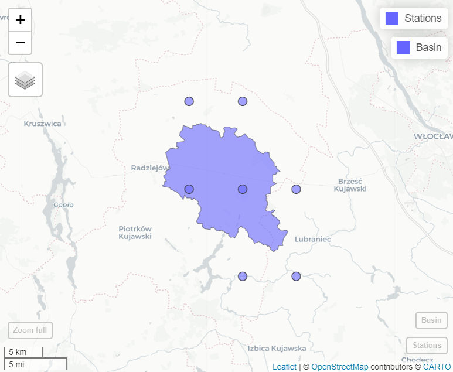
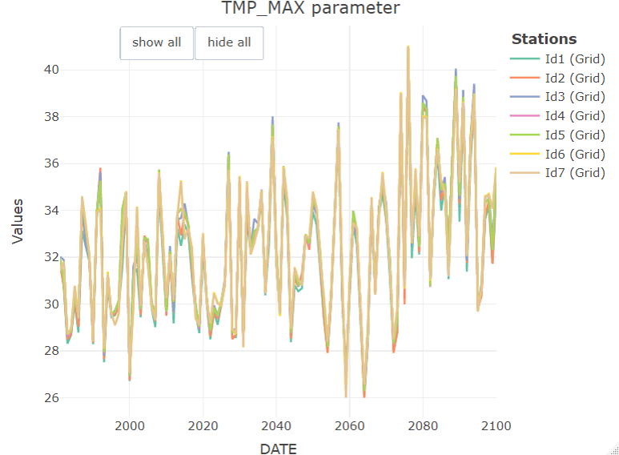
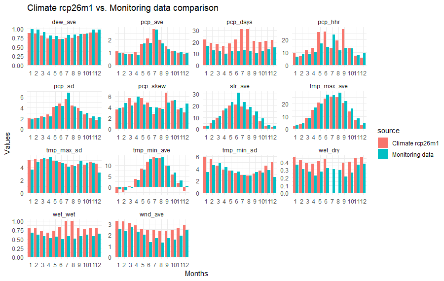

```{r setup, include=FALSE}
knitr::opts_chunk$set(echo = TRUE)
```

## Introduction

Intensification of climate change is raising multiple questions for water management, which often can be addressed using modeling tools such as SWAT+. To make it happen, it is necessary in first step to prepare climate forcing data, usually originating from selected global or regional climate models. GCM or RCM simulations usually undergo downscaling and/or bias adjustment before being applied in hydrological contexts. For example, in OPTAIN project, bias adjusted climate forcing data were prepared for 14 small agricultural catchments in Europe and are available on [Zenodo](https://zenodo.org/record/6202062#.ZHYrXHZByUk). In the final step, prepared climate datasets should be transformed into SWAT+ text file format. The model also requires that weather generator and other files are updated for correct representation of climate scenario. This section only covers the final step of climate data conversion into SWAT+ model input and updating of relevant files.

## Input format

`SWATprepR` functions can be applied on weather data delivered in two type of input formats:

1. `NetCDF` files delivered with *.nc* files. In this case required variables should be saved into files saved with following names:
    + Daily precipitation - *prec.nc*; 
    + Relative humidity - *relHum.nc*;
    + Solar radiation - *solarRad.nc*;
    + Maximum daily temperature - *Tmax.nc*;
    + Minimum daily temperature - *Tmin.nc*;
    + Average wind speed - *windSpeed.nc*.
2. SWAT+ weather input text files. In this case following file endings represent different parameters:
    + Daily precipitation - *.pcp*; 
    + Relative humidity - *.hmd*;
    + Solar radiation - *slr*;
    + Minimum and maximum daily temperature - *.tmp*;
    + Wind speed - *.wnd*.

### Case 1 - extracting from NetCDF

`NetCDF` data can't be directly used in SWAT+ model. Thus `SWATperpR` package provides [load_climate_lst](../reference/load_climate_lst.html) function to extract weather data from *.nc* file into R format used by this package. This function only needs a path to your basin shape file and a path to folder with *.nc* files. Following lines provides an example how to use it.

```{r ext_cli, eval = FALSE, message = FALSE, warning = FALSE}
library(SWATprepR)
basin_path <- "GIS/basin.shp"
cordex_path <- "climate/CORDEX-BC"
climate_lst <- load_climate_lst(cordex_path, basin_path)
```

The function creates virtual stations for each `NetCDF` grid cell touching basin boundary touches. Virtual stations coordinates are defined as center of grid cell centers. Then, for each of these virtual stations, data are extracted and saved in the nested list format. 

```{r fig-basin, echo=FALSE, out.width='70%', out.height ='70%', fig.align = 'center'}

```

[load_climate_lst](../reference/load_climate_lst.html) function could also extract data for specific stations. In this case nested lists with dataframes should be provided (common format used in this package that could be prepared by [load_template](../reference/load_template.html) function). 

Nested structure:

+ *meteo_lst*
    + *data*
        + Station ID
            + VARIABLE
                + Dataframe (DATE, VARIABLE). 
    + *stations*
        + Dataframe (ID, Name, Elevation, Source, geometry, Long, Lat) 

```{r ext_cli2, eval = FALSE, message = FALSE, warning = FALSE}
temp_path <- system.file("extdata", "weather_data.xlsx", package = "SWATprepR")
met_lst <- load_template(temp_path, 3035)
climate_lst <- load_climate_lst(cordex_path, met_lst)
```

###  Case 2 - preparing climate set from SWAT+ format

In case climate dataset is already in SWAT+ format it could be loaded into R nested list format with [load_swat_weather](../reference/load_swat_weather.html) function. This function allow loading any SWAT+ weather data. The only required input is a path to folder with data. The function will read and load all SWAT+ input weather files available in this folder. 

```{r ext_cli3, eval = FALSE, message = FALSE, warning = FALSE}
input_folder <- "my_climate_data"
climate_lst <- load_swat_weather(input_folder)
```

Following functions presented in this page  are independent of the way climate data are loaded into R. 

## Examining climate data

Loaded climate data can be examined with functions available in the `SWATperpR` package. For instance the function [plot_weather](../reference/plot_weather.html) can be used to plot climate data. The function [plot_weather_compare](../reference/plot_weather_compare.html) can help compare climate data to measurement data by plotting both in the same figure. 

```{r plot_cli, eval = FALSE, message = FALSE, warning = FALSE}
plot_weather(climate_lst, "TMP_MAX", "year", "max")
```

```{r fig-temp, echo=FALSE, out.width='70%', out.height ='70%', fig.align = 'center'}

```

Another [plot_wgn_comparison](../reference/plot_wgn_comparison.html) function might be useful to get statistical comparison of climate model data with monitoring data used to drive the model in calibration/validation periods. The function automatically filters climate model data for available monitoring data time interval. Thus comparison is only for same time period data.  

```{r plot_wng, eval = FALSE, message = FALSE, warning = FALSE}
##Loading data from the template with load_template function
temp_path <- "my_folder/weather_data.xlsx"
met_lst <- load_template(temp_path, 4326)
##And plotting comparison of statistical values with climate data
plot_wgn_comparison(climate_lst, met_lst, , "ID20", "ID2", "Climate rcp26m1", "Monitoring data", "comparison")
```

```{r fig-wng, echo=FALSE, out.width='100%', out.height ='100%', fig.align = 'center'}

```

Other functions from [Weather data section](../articles/weather.html) are also applicable. This allows to update SWAT+ *.sqlite* [database](https://biopsichas.github.io/SWATprepR/articles/weather.html#wgn-input-function) with climate data, prepare [weather generator](https://biopsichas.github.io/SWATprepR/articles/weather.html#wgn-input-function) parameters, etc.

## Preparing SWAT+ climate forsing data

[prepare_climate](../reference/prepare_climate.html) function is used prepare/update model input text files needed to run climate scenarios. Nothing else is needed just to replace model input files with prepared set of files. The function prepares following files:

+ Weather time series input files: *.pcp*, *.slr*, *.hmd*, *.tmp*, *.wnd*;
+ Reference files for weather files: *wnd.cli*, *tmp.cli*, *pcp.cli*, *slr.cli*, *hmd.cli*;
+ Weather generator files: *weather-sta.cli*, *weather-wgn.cli*.

The function also updates *aquifer.con*, *chandeg.con*, *hru.con*, *reservoir.con*, *rout_unit.con* and *time.sim* SWAT+ model input files.

Following lines provides example in which  [prepare_climate](../reference/prepare_climate.html) function runs in several loops and prepares all climate data input sets and folder structure in one go.  

```{r get_cli, eval = FALSE, message = FALSE, warning = FALSE}
##Path to your SWAT+ model project directory
project_dir <- "../output/overwrite/tmp"
##These files will be copied from model directory and updated with prepare_climate function
files_to_copy <- paste(project_dir, c("aquifer.con", "chandeg.con", "hru.con", "reservoir.con", "rout_unit.con", "time.sim"), sep="/")

##Main loop for each rcp
for (rcp in c("rcp26", "rcp45", "rcp85")){
  ##Each rcm
  for (rcm in as.character(c(1:6))){
    ##Loading climate data from SWAT+ input files
    climate_lst <- load_swat_weather(paste("my_climate_data_folder", rcp, rcm, sep = "/"))
    ##Each period
    for(p in list(c("H", "1988-01-01", "2020-12-31"), c("N", "2033-01-01", "2065-12-31"), c("E", "2067-01-01", "2099-12-31"))){
      ##Creating new directory
      cli_dir <- paste("../output/cli", rcp, paste0("rcm", rcm), p[1], sep = "/")
      dir.create(cli_dir, recursive = TRUE)
      ##Coping files to update
      file.copy(files_to_copy, paste(cli_dir, c("aquifer.con", "chandeg.con", "hru.con", "reservoir.con", "rout_unit.con", "time.sim"), sep = "/"), overwrite = TRUE)
      ##Running function to prepare climate input for scenario
      prepare_climate(climate_lst, cli_dir, p[2], p[3])
      print(paste(rcp, "rcm", rcm, p[1], p[2], "-", p[3], "set prepared."))
    }
  }
}
```
