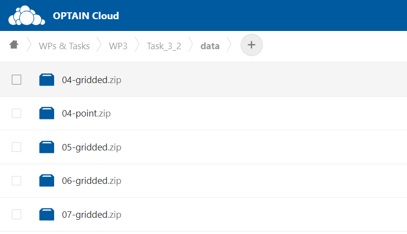

```{r setup, include=FALSE}
knitr::opts_chunk$set(echo = TRUE)
```

## Introduction

Climate data in the [OPTAIN project](https://www.optain.eu/) for each case study site could be obtained from
[UFZ-Cloud](https://nc.ufz.de/s/KA9Cr2bbtALGMHr/authenticate/showShare). It is located under *WPs&Tasks\>WP3\>Task_3\_2\>data* path. 


```{r fig-cloud, echo=FALSE, out.width='100%', out.height ='100%', fig.align = 'center'}

```

Numbers are referring to a case study number and *gridded.zip* files contains `NetCDF` files with climate data for each case study basin. Data are provided for precipitation, solar radiation, relative humidity, min, max, mean temperature and wind speed variables. Time period covered is starting from 1981-01-01 while ending 2099 or 2100. Three representative concentration pathways (RCPs) available (RCP2.6, RCP4.5, RCP8.5) and six regional climate models (RCMs). Detained information about RCMs is provided in the table below.

| Model number | Driving Model (GCM) | Ensemble |    RCM     |  End date  |
|:------------:|:-------------------:|:--------:|:----------:|:----------:|
|      1       |      EC-EARTH       | r12i1p1  | CCLM4-8-17 | 31.12.2100 |
|      2       |      EC-EARTH       |  r3i1p1  |  HIRHAM5   | 31.12.2100 |
|      3       |     HadGEM2-ES      |  r1i1p1  |  HIRHAM5   | 30.12.2099 |
|      4       |     HadGEM2-ES      |  r1i1p1  |  RACMO22E  | 30.12.2099 |
|      5       |     HadGEM2-ES      |  r1i1p1  |    RCA4    | 30.12.2099 |
|      6       |     MPI-ESM-LR      |  r2i1p1  |  REMO2009  | 31.12.2100 |


All RCMs data were bias-corrected to the [ERA5-Land](https://cds.climate.copernicus.eu/cdsapp#!/dataset/reanalysis-era5-land?tab=overview) climate data. Description of data preparation and analysis of they is provided in the project deliverable [D3.1: Climate scenarios for integrated modelling](https://www.optain.eu/sites/default/files/delivrables/OPTAIN%20D3.1%20-%20Climate%20scenarios%20for%20integrated%20modelling.pdf).

## NetCDF to SWAT+ input

There is no direct way of using `NetCDF` data in the SWAT model. Therefore tools have been prepared for the users and provided included this package.

### Extracting from NetCDF

First step to prepare SWAT+ climate input data is to download *XX-gridded.zip* file for your case study site and to unzip it. Then locate *CORDEX-BC* folder. Data extraction from `NetCDF` is done with [load_climate_lst](../reference/load_climate_lst.html) function, which only needs path to your basin shape file and path to *CORDEX-BC* folder. Following lines provides an example how to use it.

```{r ext_cli, eval = FALSE, message = FALSE, warning = FALSE}
library(SWATprepR)
basin_path <- "GIS/basin.shp"
cordex_path <- "climate/CORDEX-BC"
climate_lst <- load_climate_lst(cordex_path, basin_path)
```

The function creates virtual stations for each `NetCDF` grid cell, which basin boundary touches. Virtual stations coordinates are defined as center of grid cell. Then for each of this virtual station data are extracted and saved in the list of list format. 

```{r fig-basin, echo=FALSE, out.width='100%', out.height ='100%', fig.align = 'center'}
knitr::include_graphics('fig_basin.png')
```

### Evaluating climate data

Extraction result is arranged in specific format. *RCP -\> RCM* are the top levels of the list format. Then format is same as with other meteorological data used in
this package.

-   Meteo data list
    -   *stations* sf Data frame (ID, Name, Elevation, Source, geometry,
        Long, Lat)
    -   *data* -\> Station ID -\> Variable -\> Data frame (DATE, Variable)


Therefore other package function as [plot_weather](../reference/plot_weather.html) could be used to examine function results or to compare to measurement data, for instance with [plot_weather_compare](../reference/plot_weather_compare.html).

```{r plot_cli, eval = FALSE, message = FALSE, warning = FALSE}
plot_weather(climate_lst[["rcp85"]][["1"]],"TMP_MAX", "year", "max")
```

```{r fig-temp, echo=FALSE, out.width='100%', out.height ='100%', fig.align = 'center'}
knitr::include_graphics('fig_temp.png')
```
[plot_wgn_comparison](../reference/plot_wgn_comparison.html) function might be useful to get climate set statistical comparison with motoring data. 

```{r plot_wng, eval = FALSE, message = FALSE, warning = FALSE}
##Loading data from the template with load_template function
temp_path <- "my_folder/weather_data.xlsx"
met_lst <- load_template(temp_path, 4326)
##And plotting comparison of statistical values with climate data
plot_wgn_comparison(climate_lst[["rcp85"]][["1"]], met_lst, "ID4", "ID2", "Climate set", "Monitoring data", "comparison")
```

```{r fig-wng, echo=FALSE, out.width='100%', out.height ='100%', fig.align = 'center'}
knitr::include_graphics('fig_wng.png')
```

Other functions from [Weather data section](../articles/weather.html) are also applicable. This allows to update SWAT+ *.sqlite* [database](https://biopsichas.github.io/SWATprepR/articles/weather.html#wgn-input-function) with climate data, prepare [weather generator](https://biopsichas.github.io/SWATprepR/articles/weather.html#wgn-input-function) parameters, etc.

### Preparing SWAT+ input climate sets

Nevertheless [prepare_climate](../reference/prepare_climate.html) function could be used to directly prepare/update model input text files needed to run each climate scenario. Nothing else is needed just to replace model input files with prepared set of files. 

Following lines runs [prepare_climate](../reference/prepare_climate.html) function in several loops and prepares all climate data input sets and folder structure.  

```{r get_cli, eval = FALSE, message = FALSE, warning = FALSE}
##Path to your SWAT+ model project directory
project_dir <- "../output/overwrite/tmp"
##These files will be copied from model directory and updated with prepare_climate function
files_to_copy <- paste(project_dir, c("aquifer.con", "chandeg.con", "hru.con", "reservoir.con", "rout_unit.con", "time.sim"), sep="/")

##Main loop for each rcp
for (rcp in c("rcp26", "rcp45", "rcp85")){
  ##Each rcm
  for (rcm in as.character(c(1:6))){
    ##Each period
    for(p in list(c("H", "1988-01-01", "2020-12-31"), c("N", "2033-01-01", "2065-12-31"), c("E", "2067-01-01", "2099-12-31"))){
      ##Creating new directory
      cli_dir <- paste("../output/cli", rcp, paste0("rcm", rcm), p[1], sep = "/")
      dir.create(cli_dir, recursive = TRUE)
      ##Coping files to update
      file.copy(files_to_copy, paste(cli_dir, c("aquifer.con", "chandeg.con", "hru.con", "reservoir.con", "rout_unit.con", "time.sim"), sep = "/"), overwrite = TRUE)
      ##Running function to prepare climate input for scenario
      prepare_climate(climate_lst[[rcp]][[rcm]], cli_dir, p[2], p[3])
      print(paste(rcp, "rcm", rcm, p[1], p[2], "-", p[3], "set prepared."))
    }
  }
}
```
