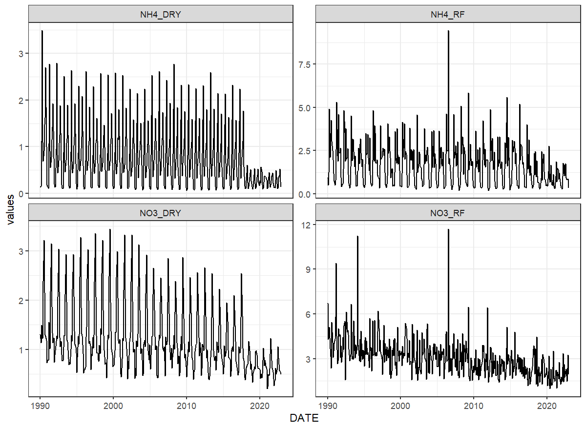

```{r setup, include=FALSE}
knitr::opts_chunk$set(echo = TRUE)
```

## Introduction

According to @grizzetti2005 study done in three catchments in Europe atmospheric deposition constituted between 3 and 16% of total nitrogen inputs. @helcom2018 report indicates the around 30% of nitrogen load to the Baltic Sea comes from atmospheric deposition, while it contributes from 1 to 10% of nitrogen load to inland surface waters in sea surrounding countries. Therefore setting atmospheric deposition to appropriate level should help better constrain other parameters responsible for nitrogen transport processes in the catchment.

[SWAT+](https://swat.tamu.edu/software/plus/) considers nitrogen deposition (NH4 and NO3), but not phosphorous deposition. Both wet and dry deposition is taken into account. Wet deposition is absorption of compounds by rain and snow as they fall and is expressed in $mg/l$, whereas dry deposition is direct adsorption of compounds to water and land surfaces, expressed in $kg/ha/year$. SWAT+ allows constant, annual or monthly input data on atmospheric deposition. The choice is controlled by *atmo* parameter in the *'codes.bsn'* file. 

## EMEP data

Nitrogen atmospheric could be obtained from local sources. However, if local data in not available or not all parameters available, deposition data can be extracted from European Monitoring and Evaluation Programme (EMEP) provided [MSC-W model data files](https://www.emep.int/mscw/mscw_moddata.html). The EMEP portal provides gridded 0.1$^{\circ}$ resolution *netCDF* data over Europe. MSC-W model [grid covers territory](https://www.emep.int/grid/lonlatgrid.pdf) between -30 to 90 longitude and  30 to 82 latitude with 50x50 km^2^ grid cell. The parameters, which are needed for SWAT+ model are: 

- *DDEP_OXN_m2GridDry* - deposition of oxidized nitrogen per m2 grid ($mgN/m^2$);
- *WDEP_OXN* - wet deposition of oxidized nitrogen ($mgN/m^2$); 
- *DDEP_RDN_m2Grid* - dry deposition of reduced nitrogen per m2 grid ($mgN/m^2$); 
- *WDEP_RDN* - wet deposition of reduced nitrogen ($mgN/m^2$).
- *WDEP_PREC* - precipitation ($mm$).

These parameters can be used to prepare following SWAT+ parameters required for *'atmo.cli'* input file:

- *NH4_RF* - ammonia in rainfall ($mg/l$);
- *NO3_RF* - nitrate in rainfall ($mg/l$);
- *NH4_DRY* - ammonia dry deposition ($kg/ha/yr$);
- *NO3_DRY* - nitrate dry deposition ($kg/ha/yr$). 

EMEP provides access to yearly, monthly, daily and hourly data. Data for a selected catchment with required time step could be extracted directly from [EMEP website](https://www.emep.int/mscw/mscw_moddata.html) with [get_atmo_dep](../reference/get_atmo_dep.html) function. Function requires just path to catchment boundary shape file and internet connection. Depending of the data time step selected (yearly or monthly), function will need more or less time to run (less with "year" selected, more with "month"). More information about the inclusion of atmospheric deposition data in SWAT+ modeling is presented in the section 3.10 of [SWAT+ modelling protocol](https://doi.org/10.5281/zenodo.7463395).

```{r atmo_dep, eval=FALSE, message = FALSE, warning = FALSE}
library(SWATprepR)
library(tidyverse)
basin_path <- system.file("extdata", "GIS/basin.shp", package = "SWATprepR")
df <- get_atmo_dep(basin_path)
##Plot results
ggplot(pivot_longer(df, !DATE, names_to = "par", values_to = "values"), aes(x = DATE, y = values))+ 
  geom_line()+ 
  facet_wrap(~par, scales = "free_y")+ 
  theme_bw()
```

```{r fig-atmo, echo=FALSE, out.width='100%', fig.align = 'center'}

```

## SWAT+ input

Atmospheric deposition data into SWAT+ model can be included via *'atmodep.cli'* file. For this [add_atmo_dep](../reference/add_atmo_dep.html) function was designed. It could write yearly, monthly or whole modeled period averages. Function requires only [get_atmo_dep](../reference/get_atmo_dep.html) function output for yearly or monthly data. SWAT+ model setup `.sqlite` database has to be updated too. Thus, this function updates also required tables. In case other than average yearly atmospheric deposition data are used, *t_ext* function parameter should be provided. Please read more in [add_atmo_dep](../reference/add_atmo_dep.html).

```{r atmo_write, eval=FALSE, message = FALSE, warning = FALSE}
db_path <- "./output/test/project.sqlite"
add_atmo_dep(df, db_path)
```
