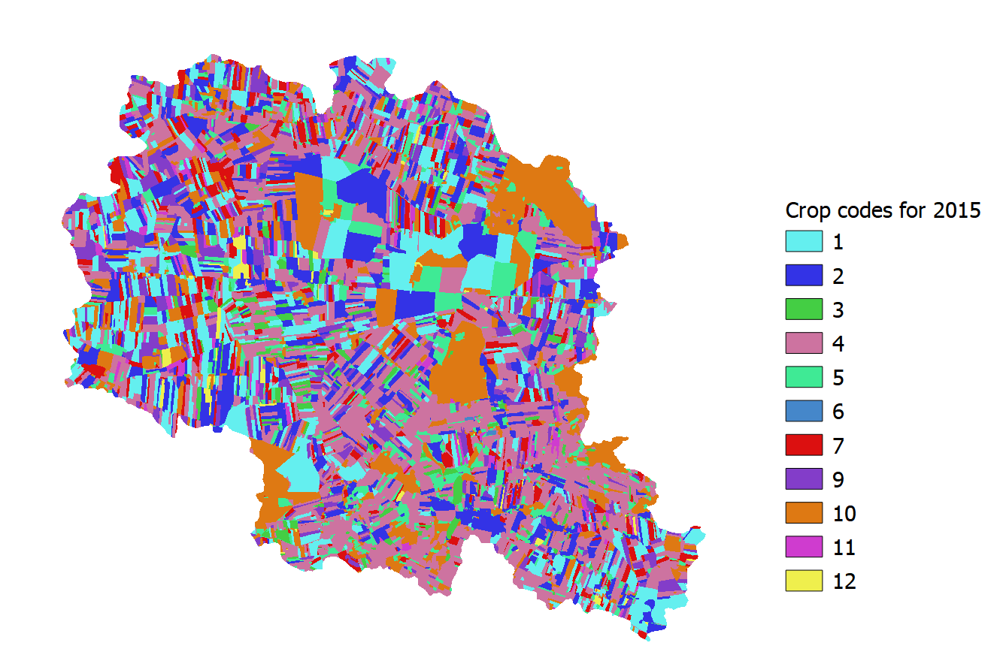

```{r setup, include=FALSE}
knitr::opts_chunk$set(echo = TRUE)
```

## Introduction

Preparation of land use data for the [SWATbuildR](https://git.ufz.de/optain/wp4-integrated-assessment/swat/bildr_script)^[Currently requires access to OPTAIN https://git.ufz.de/optain] is among the most difficult tasks as it requires collection and combination of multiple GIS datasets (crop land, tile drain extent, Natural/Small Water Retention Measures (NSWRMs) installation sites, etc.). Moreover, it also requires putting a lot of efforts into cleaning topological issues from prepared layer. However, even more difficult task is to prepare land use time series data required for the preparation of [management schedules](https://swatplus.gitbook.io/docs/user/editor/inputs/land-use-management#management-schedules) necessary for [SWAT+ model](https://swat.tamu.edu/software/plus/). This page will provide tools (or links to them) and workflow to help with this task. Particular focus is paid for preparing land use time series data (when local data are not available) from remote sensing sources required for [SWATfarmR](http://chrisschuerz.github.io/SWATfarmR/) tool. 

## Land use layer

Merging different data sets, cleaning topological errors and preparing the final layer directly usable in `SWATbuildR` is a quite time consuming task. It can be done with the Python script we have prepared for such task. This script with an example data is available on [zenodo page](https://doi.org/10.5281/zenodo.7509101). `arcpy` library is required with ArcGIS *Advanced* license. 

In order to run scrip following GIS datasets should be collected:

- General land cover covering all area (raster);
- Catchment boundary (polygon);
- Crop fields (polygon);
- River channels (line);
- Tile drain extent (polygon);
- Measure extent (polygon)^[Any number of these layers can be used].

These GIS layers should be adjusted to fit structure of example data or the script should be adjusted to fit input data structure. After successfully running script resulting data layer should be inline with `SWATbuildR` requirements (please see [SWAT+ modeling protocol](https://doi.org/10.5281/zenodo.7463395) sections 2.2 and 2.3). An example of data structure is provided below.

```{r lu, message = FALSE, warning = FALSE}
##Loading libraries
library(SWATprepR)
library(tidyverse)
library(sf)
##Loading data
lu_path <- system.file("extdata", "GIS/lu_layer.shp", package = "SWATprepR")
lu <- st_read(lu_path,  quiet = TRUE)
##Adding IDs to land use field data and selected required columns
lu <- mutate(lu, id = row_number()) %>% 
  select(id, type, drainage, measures)
##Printing structure of the data
str(lu)
```

## Remote sensing 

SWAT+ model has important capabilities to simulate impacts of agriculture on water flows and water quality in water bodies. However, this requires information about agricultural activities in a selected area. One of the most important is crop rotation data. Yet, such information rarely is available or freely accessible. In such cases remote sensing data could be used to generate information about crops for selected time period. More information about this is provided in [SWAT+ modeling protocol](https://doi.org/10.5281/zenodo.7463395) section 4.1.1). 

### Google Earth script

In the framework of the [OPTAIN project](https://www.optain.eu/) deliverable 3.2 [@szabo-2022], a [Google Earth Engine-based](https://code.earthengine.google.com/) script [@meszaros2022] was developed to predict crop types with the random forest method based on time series reflectance data of [Sentinel](https://sentinel.esa.int/web/sentinel/missions/sentinel-1) 1A and 1B satellite radar images. Output of the script is a series of crop maps starting from the year 2015 to latest available year. Required input data:

- Catchment boundary;
- Training points;
- Parcel/field boundaries.

### Input data

Training data is necessary for the classification algorithm. In case no crop types data is  available [LUCAS: Land Use and Coverage Area frame Survey](https://esdac.jrc.ec.europa.eu/projects/lucas) data can be used. In our case we had local data for year 2021. This was used for the preparation of training set. 

However, before generating training set for a remote sensing algorithm is good practice to examine input data. In an example below, areas for each land use/crop type were calculated and provided as a figure. As a general recommendation land use/crop types with very small areas should be eliminated from further workflow. In provided example crop types with areas occupying less than *0.1%* were assigned general code *"agrl"*. Thus eliminated from further workflow. 

```{r lu_view, message = FALSE, warning = FALSE}
##Calculating areas in ha and % for land uses/crops
lu_area <- lu["type"] %>% 
  mutate(area = st_area(geometry)) %>% 
  st_drop_geometry() %>%
  group_by(type) %>%
  summarise_all(sum) %>%
  mutate(area = as.numeric(area/10000)) 
lu_area["Sum"] <- sum(lu_area$area)
lu_area["Area [%]"] <- round(100*lu_area$area/lu_area$Sum, 2)
##Printing figure
ggplot(lu_area, aes(x = reorder(type, `Area [%]`), y = `Area [%]`)) +
  geom_bar(stat="identity", mapping = aes(fill = type))+
  geom_text(aes(x = type, label = `Area [%]`), hjust = -0.1, size = 3)+
  labs(y = "area in %", x = "crops/land use")+
  ylim(0, 25) +
  coord_flip()+
  theme_bw()+
  theme(axis.text.y = element_text(size = 8))

##Eliminating very small types
lu$type[lu$type %in% c("past", "herb", "csil")] <- "agrl"
```
### Training data

Remote sensing script requires training points with information about year and land use/crop type. Such data can be prepared with [get_lu_points](../reference/get_lu_points.html) function. This function requires preparation of *lookup* table where each land use has assigned numeric code. Moreover, some land use type as forest, water, urban land uses also will not be participating in the rotation. These should be set aside. 

```{r lu_pts, message = FALSE, warning = FALSE}
##Preparation of lookup table
lookup <- data.frame(lc1 = seq(1:length(unique(c(lu$type)))),
                     type = unique(c(lu$type)))
##Setting, which land uses will not change 
lu_constant <- c("fesc", "orcd", "frst", "frse", "frsd", "urld", "urhd", "wetl", "watr", "agrl")
##Obtaining training data
pts <- get_lu_points(lu, 2021, lookup, lu_constant)
##Plotting points to be used in remote sensing algorithm training 
ggplot(pts %>% left_join(lookup, by = "lc1")) + 
  geom_sf(mapping = aes(col = type)) +
  scale_color_brewer(palette = "Paired", name = "Crop type")+
  theme_void()
```

GIS layers have to be prepared and saved into *.shp* files to be transferred to the Google Earth Engine. These files can be directly used with the classification script.

```{r lu_pts_write, eval=FALSE, message = FALSE, warning = FALSE}
##Preparing just the boundary data for fields
parcels <- lu["id"] %>% 
  st_transform(4326)
##Preparing basin data 
output_path <- "../output/"
basin_path <- system.file("extdata", "GIS/basin.shp", package = "SWATprepR")
catchment <- st_read(basin_path, quiet = TRUE) %>% 
  select() %>% 
  mutate(name = "Upper_Zglowiaczka") %>% 
  st_transform(4326)
##Writing all the necessary training data for remote sensing algorithm.
st_write(pts, paste0(output_path, "pts.shp"), append = F)
st_write(parcels, paste0(output_path, "lu_prcl.shp"), append = F)
st_write(catchment, paste0(output_path, "catchment.shp"), append = F)
```

### Rotation extraction

Running [Google Earth Engine-based](https://code.earthengine.google.com/) script prepared by @meszaros2022 generates *.tif* raster file with bands for each year land use/crop types (represented by numeric codes). One year example of classification results are provided below. 

```{r fig-lu, echo=FALSE, out.width='80%', fig.align = 'center'}

```

For this *.tif* file [extract_rotation](../reference/extract_rotation.html) function can be applied to extract all crop rotation information. This information is delivered in a format directly usable by [SWATfarmR](http://chrisschuerz.github.io/SWATfarmR/) input data preparation scripts, which are applied to generate SWAT+ management crop [rotation schedules](https://swatplus.gitbook.io/docs/user/editor/inputs/land-use-management#management-schedules). In our example complex rotations for period 2015-2022 were extracted for each field from remote sensing classification results. Results were saved in a new shape file. Attribute table example is printed below.

```{r lu_results, eval=FALSE, message = FALSE, warning = FALSE}
##Loading results for accuracy
lu_rot <- extract_rotation(lu, 2015, "cropmaps2015_2022.tif", "../output/", lookup, lu_constant)

##Overwriting 2021 year classification results since actual data were available. 
##Also removing results were land use should be constant
lu_rot <- lu_rot %>% 
  mutate(y_2021 = ifelse(!is.na(y_2021), type, NA)) %>% 
  select(-type) %>% 
  mutate_at(vars(starts_with("y_")), ~ifelse(lu %in%  lu_constant,NA,.))

##Writing results for SWATfarmR input preparation functions
st_write(lu_rot , paste0(output_path, "lu_rot.shp"), append = F)
# write.csv(lu_rot %>% st_drop_geometry(), "lu_rot.csv", row.names = F)
```

Example of prepared attribute table is provided below. It fulfills requirements set in [SWAT+ modeling protocol](https://doi.org/10.5281/zenodo.7463395) section 4.1.1. 

```{r lu_results_print, message = FALSE, warning = FALSE}
lu_rot_df <- read.csv(system.file("extdata", "lu_rot.csv", package = "SWATprepR"))
print(head(lu_rot_df, 10))
```

Prepared attribute table can be looped, if longer time series of crop rotation data is needed. Following lines provides example how time series could be extended. Additionally, write 

```{r lu_extend, eval = FALSE, message = FALSE, warning = FALSE}
i=1
df <- lu_rot
##Loop to extend time series
while(i != 5){
  df <- bind_cols(df, lu_rot_df[,c(2:9)])
  i = i +1
}
##Write the column names and the final file
colnames(df) <- c("lu", paste0("y_", seq(1983,2022)), "geometry")
##To get 33 years exact
df <- df[-c(2:8)]
st_write(df, paste0(output_path, "lu_rot_final.shp"), append = F)
```

Final few lines to write input for the SWATbuildR.  

```{r lu_buildr, eval = FALSE, message = FALSE, warning = FALSE}
lu$type <- df$lu
lu[lu$drainage == 0, "drainage"] <- NA
##Write land use input file for SWATbuildR
st_write(st_make_valid(lu), paste0(output_path, "land.shp"), append = F)
```

